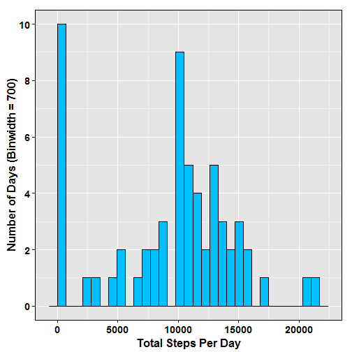
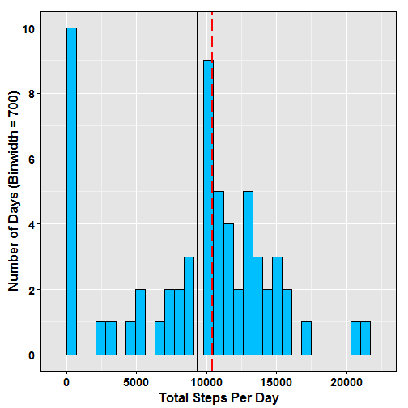
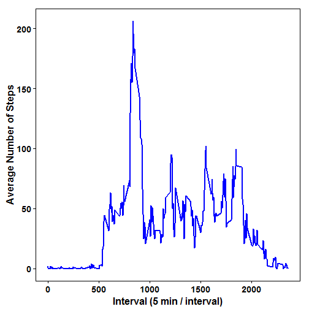
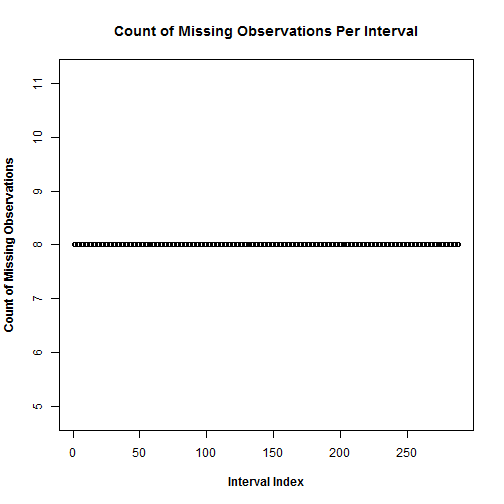
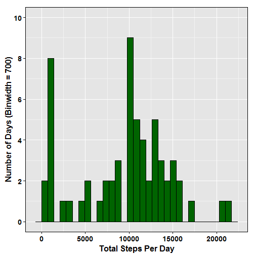
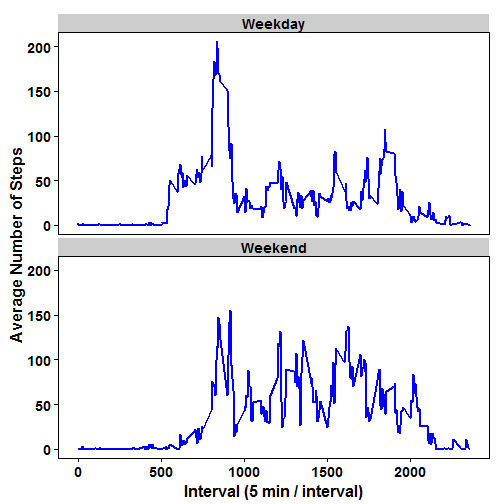
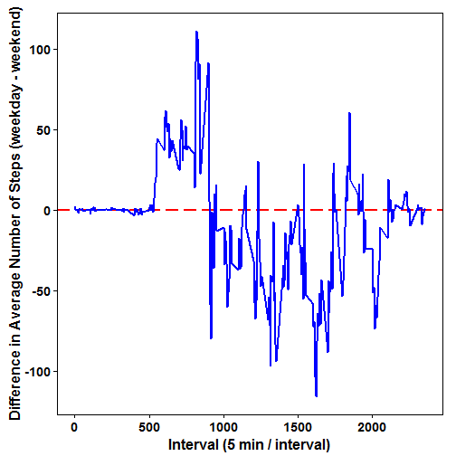

## 1. Loading and preprocessing the data

#### 1a. Load required modules

```r
packs <- c("ggplot2","dplyr","lubridate","scales","knitr")
lapply(packs, require, character.only=T)
```

#### 1b. Load data file; Downloaded to local

```r
data <- read.csv("activity.csv",stringsAsFactors=FALSE)
```
In my opinion, the current format of the data is appropriate for my planned analyses.

## 2. What is mean total number of steps taken per day?
The mean number of steps taken per day is 9354.23 steps, and the median number
of steps taken per day is 10395. The code used to determine this, as well as 
a histogram showing the distribution of average steps per day, is provided below.

#### 2a. Calculate the total number of steps taken per day
##### Group by date
Begin by using the group_by function from the dplyr package to group the
main data frame by the date column.

```r
by_date <- group_by(data,date)
```

##### Get the total number of steps taken each day
Use the "summarise" function from the dplyr package to get the total 
total number of steps taken each day.

```r
steps.per.day <- summarise(by_date,total_steps=sum(steps,na.rm=T))
```

#### 2b. Make a histogram of the total number of steps taken each day
Using the data frame "steps.per.day", make a histogram showing the distribution
of total steps taken each day across each of the 61 days for which data were 
available.

```r
ggplot(steps.per.day,aes(total_steps)) + 
  geom_histogram(fill="deepskyblue",color="black",binwidth=700) +
  xlab("Total Steps Per Day") + 
  ylab("Number of Days (Binwidth = 700)") +
  scale_y_continuous(breaks=seq(0,10,2)) +
  theme(axis.title.x = element_text(face='bold',size=16,vjust=0.1),
        axis.title.y = element_text(face='bold',size=16,vjust=0.8),
        axis.text.x = element_text(face='bold',size=14,color='black'),
        axis.text.y = element_text(face='bold',size=14,color='black'),
        axis.ticks.x = element_line(color="black"),
        axis.ticks.y = element_line(color="black"),
        panel.border = element_rect(color="black",fill=FALSE))
```

 

_Figure 1. Histogram showing the distribution of total steps taken per day._

#### 2c. Calculate and report the mean and median of the total number of steps taken per day
Using the data frame "steps.per.day", get the mean and median for total steps taken 
across all 61 days for which data were available.

```r
summarise(steps.per.day,mean_steps=mean(total_steps),med_steps=median(total_steps))
```

```
## Source: local data frame [1 x 2]
## 
##   mean_steps med_steps
## 1    9354.23     10395
```

##### Add mean and median lines to histogram.
 

_Figure 2. Histogram showing the distribution of total steps taken per day._  
_The solid black line shows the mean, and the red dotted line shows the median._

This was accomplished by adding the following line to the graph 
code above:

```r
geom_vline(x=c(9354.23,10395),
        linetype=c("solid","longdash"),
        color=c("black","red"),size=1)
```

## 3. What is the average daily activity pattern?
#### 3a. Make a time series plot (i.e. type = "l") of the 5-minute interval (x-axis) and the average number of steps taken, averaged across all days (y-axis)

##### Group by interval

```r
by_interval <- group_by(data,interval)
steps.ave.interval <- summarise(by_interval,mean_steps=mean(steps,na.rm=T),
                                med_steps=median(steps,na.rm=T))
```
The resulting data frame has 288 cases (17568 5 min intervals / 61 days), which is what was expected.

##### Create the time series plot using ggplot2 plotting system
The ggplot2 plotting system is my super favorite plotting system. <3
Here's my time series plot:

```r
ggplot(steps.ave.interval,aes(interval,mean_steps)) + 
  geom_line(color="blue",size=1) +
  xlab("Interval (5 min / interval)") +
  ylab("Average Number of Steps") +
  theme(axis.title.x = element_text(face='bold',size=16,vjust=0.1),
        axis.title.y = element_text(face='bold',size=16,vjust=0.8),
        axis.text.x = element_text(face='bold',size=14,color='black'),
        axis.text.y = element_text(face='bold',size=14,color='black'),
        axis.ticks.x = element_line(color="black"),
        axis.ticks.y = element_line(color="black"),
        panel.grid = element_blank(),
        panel.background = element_rect(fill="white"),
        panel.border = element_rect(color="black",fill=FALSE))
```

 

_Figure 3. Time series graph showing the average number of steps per interval across all days._

#### 3b. Which 5-minute interval, on average across all the days in the dataset, contains the maximum number of steps?
##### Get the index of the inverval that contains the max value
From the data frame steps.ave.interval, find the index of the maximum value
for the mean number of steps in that five-minute interval:

```r
max_in_interval <- with(steps.ave.interval,match(max(mean_steps),mean_steps))
```
Next, display the row in the data frame that contains the maximum average number of 
steps per interval.

```r
steps.ave.interval[max_in_interval,]
```

```
## Source: local data frame [1 x 3]
## 
##   interval mean_steps med_steps
## 1      835   206.1698        19
```
The interval with the highest average number of steps is interval 835. That interval
had, on average, 206.17 steps. This average is based on the average across all 61 days
for which data were available. Missing values were excluded, so the means for some intervals 
may be based on fewer than 61 observations. 

## 4. Imputing missing values
There were 2304 rows out of the total 17568 rows included in the provided data set with 
missing values for the variable "steps". Presented below is code that will replace the missing
values with the median value for that interval and evaluate the effect of having done this on 
the estimate of the mean and median number of steps taken each day.

#### 4a. Calculate and report the total number of missing values in the dataset (i.e. the total number of rows with NAs)
There were a total of 2304 rows in the data set with missing values for the variable "steps".

```r
sum(is.na(data$steps))
```

```
## [1] 2304
```

#### 4b. Devise a strategy for filling in all of the missing values in the dataset. 
My chosen data imputation strategy is to replace missing values with the median for 
the interval that includes that case. The median will be based on all non-missing values
available for that interval (median for that interval across all days).

Before I do that, I'd like to check whether the number of missing values varies across
intervals. If some intervals have a large number of missing values, median may not be the
best choice, and I may wish to evaluate other available options.

This code gets the total number of NA values for each interval:

```r
total.na.interval <- with(data,by(is.na(steps),data[,"interval"],sum,na.rm=T))
```

It looks like each interval has a total of 8 missing values out of 61 total observations.
Here's a graph showing the count of missing values across intervals:

```r
plot(total.na.interval,
     main="Count of Missing Observations Per Interval",
     xlab="Interval Index", 
     ylab="Count of Missing Observations",
     font.lab=2)
```

 

_Figure 4. Count of missing values by interval._

#### 4c. Create a new dataset that is equal to the original dataset but with the missing data filled in.
To accomplish this, I wrote code that finds each NA value in the steps column. For each NA value, 
the median value for the interval in which that case falls is retrieved from the data frame
steps.ave.interval. I'm sure this is not the most elegant way of accomplishing this, but it's all I have.
I'd love to a better code example.

First, here's a vector to hold new values:

```r
newvals <- c()
```

Next, this for loop populates the vector newvals with the values that will replace the NAs in the steps 
variable with the median value for the interval in which that observation falls. This is calculated 
based on all the non-NA values for that interval. The values used will not be computed in the for loop. 
Instead, values will be taken from the data frame created in a earlier step: steps.ave.interval. 

Here's the code:

```r
for (i in 1:nrow(data)) {
  if (is.na(data$steps[[i]]) == TRUE) {
    cur_int <- data$interval[[i]] # save the interval for the current line to a variable
    # gets cell median from steps.ave.interval data set based on searching for the current interval
    # Saves value to variable
    med_val <- steps.ave.interval$med_steps[match(TRUE,steps.ave.interval$interval == cur_int)]
    newvals <- c(newvals,med_val) # Adds value for current row to vector
  }
  # Otherwise, if the current row value is not NA, just add the current value for the row
  # to the vector newvals
  else {
    newvals <- c(newvals,data$steps[[i]])
  }
}
```

In this step I was actually planning to just add the vector to the original df as a new variable.
However, because the assignment instructions say to make another data frame, I'll go ahead and 
do that.


```r
data.no.missing <- data # copy the original df
data.no.missing$steps <- newvals # replace steps column with vector newvals
```

#### 4d. Make a histogram of the total number of steps taken each day and...
This really was a multi-part question, so I'm breaking it up.

First, using the new no-missings data frame, create a new steps.per.day data frame:


```r
by_day_nm <- group_by(data.no.missing,date)
```

Next, use "summarise" from dplyr to get total for each day. For some reason 
"summarize", which should be equivalent, doesn't always work:

```r
steps.per.day.nm <- summarise(by_day_nm,total_steps=sum(steps,na.rm=T))
```

Now I'll create the updated histogram:

```r
ggplot(steps.per.day.nm,aes(total_steps)) + 
  geom_histogram(fill="darkgreen",color="black",binwidth=700) +
  xlab("Total Steps Per Day") + 
  ylab("Number of Days (Binwidth = 700)") +
  scale_y_continuous(breaks=seq(0,10,2),limits=c(0,10)) +
  theme(axis.title.x = element_text(face='bold',size=16,vjust=0.1),
        axis.title.y = element_text(face='bold',size=16,vjust=0.8),
        axis.text.x = element_text(face='bold',size=14,color='black'),
        axis.text.y = element_text(face='bold',size=14,color='black'),
        axis.ticks.x = element_line(color="black"),
        axis.ticks.y = element_line(color="black"),
        panel.border = element_rect(color="black",fill=FALSE))
```

 

_Figure 5. Histogram showing the distribution of total steps taken per day_  
_after missing values were replaced with the interval median._


#### 4d. Part II: Calculate and report the mean and median total number of steps taken per day. 

```r
summarise(steps.per.day.nm,mean_steps=mean(total_steps),med_steps=median(total_steps))
```

```
## Source: local data frame [1 x 2]
## 
##   mean_steps med_steps
## 1   9503.869     10395
```
The mean is greater after the missing values are replaced with the interval median.

#### 4d. Part III: Do these values differ from the estimates from the first part of the assignment? 
Replacing the missing values with the median for the interval that contains that observation changes
the mean value, but it doesn't affect the median. The mean increases to 9503.9 from 9354.2.
This was not surprising to me. Nope.

Just for fun, let's add lines showing the mean and median to the histogram.

 

_Figure 6. Histogram showing the distribution of total steps taken per day_  
_after missing values were replaced with the interval median._  
_The solid black line shows the mean, and the red dotted line shows the median._  

Again, here is the code that adds the lines:

```r
geom_vline(x=c(9503.9,10395),linetype=c("solid","longdash"),color=c("black","red"),size=1)
```

## 5. Are there differences in activity patterns between weekdays and weekends?
Indeed, it does appear that there are differences in activity patterns between
weekdays and weekends. On weekends, the interval during which peak activity occurs
is later in the day (interval 915) than it is during the week (interval 835).
Also, the number of steps during that peak interval is lower on weekends (155.0) 
than it is on weekdays (205.4). Across all intervals, the average number of steps
is greater for weekends (38.2 steps) than for weekdays (31.2). Taken together, 
these findings suggest that the individual who contributed these data is, on average,
more active on weekends. However, this activity is more evenly distributed throughout
the day. On weekdays, fewer steps were taken in most intervals, so the active period
during the morning is contributing more to the overall daily activity level (as measured
by steps taken).

Here is code showing how I calculated all of that:

#### 5a. Create a new factor variable in the dataset with two levels – “weekday” and “weekend” 
The new column should indicate whether a given date is a weekday or weekend day.
There might be a way to do this in just one step, but I don't know what it is. 

##### Create a new "days of week" column in df data.no.missing

```r
data.no.missing$dow <- weekdays(as.POSIXct(data.no.missing$date))
```

##### Create the new "is_weekend" variable by recoding the variable "dow"

```r
data.no.missing$is_weekend <- with(data.no.missing,
                                   ifelse(dow == "Saturday" | dow == "Sunday","Weekend","Weekday"))
```

##### Make the new "is_weekend" column a factor

```r
data.no.missing$is_weekend <- factor(data.no.missing$is_weekend)
```

#### 5b. Make a panel plot containing a time series plot (i.e. type = "l") of the 5-minute interval x-axis) and the average number of steps taken, averaged across all weekday days or weekend days (y-axis). 
Note: There are many fewer observations for weekends, so estimates of weekend activity patterns
may be less reliable than for weekday activity patterns.

##### Group the data frame (the one with missing values replaced) by interval
First, group the data by interval, then get mean steps by interval.

```r
by_interval_weekday <- group_by(data.no.missing,is_weekend,interval)
steps.ave.interval.wd <- summarise(by_interval_weekday,mean_steps=mean(steps,na.rm=T))
# Resulting data frame has 576 cases (17568 5 min intervals / 61 days = 288; 288*2)
```

##### Create the time series plot using ggplot2:

```r
ggplot(steps.ave.interval.wd,aes(interval,mean_steps)) + 
  geom_line(color="blue",size=1) +
  xlab("Interval (5 min / interval)") +
  ylab("Average Number of Steps") +
  facet_wrap(~is_weekend,ncol=1) +
  theme(axis.title.x = element_text(face='bold',size=16,vjust=0.1),
        axis.title.y = element_text(face='bold',size=16,vjust=0.8),
        axis.text.x = element_text(face='bold',size=14,color='black'),
        axis.text.y = element_text(face='bold',size=14,color='black'),
        axis.ticks.x = element_line(color="black"),
        axis.ticks.y = element_line(color="black"),
        strip.text = element_text(face='bold',size=14,color='black'),
        panel.grid = element_blank(),
        panel.background = element_rect(fill="white"),
        panel.border = element_rect(color="black",fill=FALSE))
```

 

_Figure 7. Average number of steps by interval for weekdays and weekends_  

Looking separately at weekdays and weekends, in which interval does the maximum average 
number of steps occur?  


```r
summarise(steps.ave.interval.wd,max_steps=max(mean_steps),
          day_ave=mean(mean_steps),
          what_index=match(max_steps,mean_steps))
```

```
# Source: local data frame [2 x 4]
# 
#   is_weekend max_steps  day_ave what_index
# 1    Weekday  205.4222 31.15448        104
# 2    Weekend  155.0000 38.18880        112
```

Just for fun, let's look at which intervals throughout the day differ most between
weekdays and weekends. First, I will create a new data frame that includes a 
variable that is the difference between average number of steps for each interval
on weekdays and on weekends. 


```r
# Grab vectors out of existing data frames
steps_weekend <- with(steps.ave.interval.wd,mean_steps[289:576])
steps_weekday <- with(steps.ave.interval.wd,mean_steps[1:288])
intervals <- steps.ave.interval$interval
# Create new difference vector
activity.diff <- steps_weekday - steps_weekend
# Create the new data frame and clean up the columns.
# Sure, this could be neater code, but whatever.
activity.diff <- as.data.frame(cbind(activity.diff,intervals))
activity.diff <- activity.diff[,c(2,1)]
names(activity.diff) <- c("interval","mean_steps")
```

Now, here's a plot showing that difference. The red dashed line marks the
zero point (same activity level on weekdays and weekends). Observations 
that fall above the red line mean that the person was more active for that 
interval on weekdays, and observations that fall below the red line mean
the person was more active, on average, on weekends.


```r
ggplot(activity.diff,aes(interval,mean_steps)) +
  geom_hline(y=0,color="red",linetype="longdash",size=1) +
  geom_line(color="blue",size=1) +
  xlab("Interval (5 min / interval)") +
  ylab("Difference in Average Number of Steps (weekday - weekend)") +
  theme(axis.title.x = element_text(face='bold',size=16,vjust=0.1),
        axis.title.y = element_text(face='bold',size=16,vjust=0.8),
        axis.text.x = element_text(face='bold',size=14,color='black'),
        axis.text.y = element_text(face='bold',size=14,color='black'),
        axis.ticks.x = element_line(color="black"),
        axis.ticks.y = element_line(color="black"),
        panel.grid = element_blank(),
        panel.background = element_rect(fill="white"),
        panel.border = element_rect(color="black",fill=FALSE))
```

 

_Figure 8. Time series plot showing differences in activity level between weekdays_
_and weekends._

As can be seen in the graph, the person was more active during the morning on 
weekdays. However, in almost all intervals later in the day, the person was more
active on weekends.
